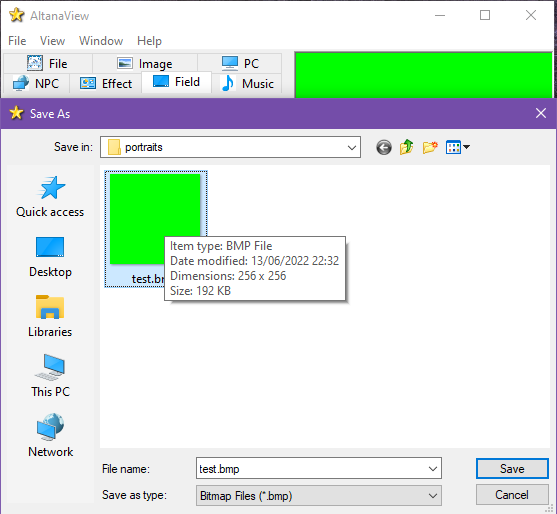
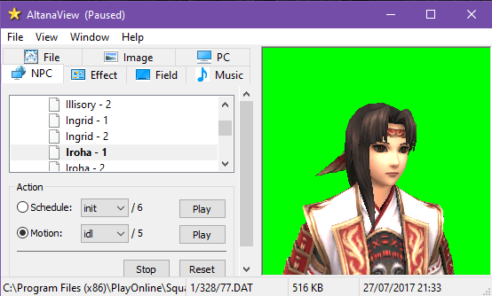

# Character Portrait Creation

This is how I made all the portraits in my portrait pack, but you could do this in many different ways if you're more comfortable with other tools.

However you make your portraits, I suggest making them 256x256 pixels to match with other packs people might make. Themes can scale them however they like, but it's good to use a common base size.

## AltanaView
Make sure the background is set to 0,255,0 (neon green).


Adjust the frame size and do `File -> Save Image...` repeatedly until it saves at 256x256 pixels - I wish AltanaView just showed the dimensions in the window D:



Load up the NPC you'd like to create a portrait of, and move them around to get a good portrait pose.
`File -> Pause` helps if their animations move them around a lot.



`File -> Save Image...` and name the file with the NPC's name, eg: Iroha.bmp

## Converting to transparent PNGs with ImageMagick
### Linux/WSL
You'll need ImageMagick installed on your Linux distro for this.

Open up a terminal and navigate to the directory where you saved your portraits.

Convert them to png, replacing neon green with transparency:
```sh
find ./ -maxdepth 1 -name "*.bmp" -type f -exec sh -c 'convert "$1" -fuzz 5% -channel rgba -fill none -opaque "#00FF00" "${1%bmp}png"' sh {} \;
```
Optionally remove all bmp files after converting:
```sh
rm *.bmp
```
You're done!

### Windows
_todo instructions_